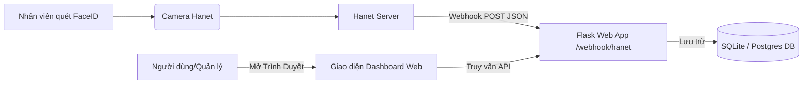

# Web App Tra Cứu Chấm Công FaceID Hanet AI Camera

Ứng dụng web hiển thị và tra cứu lịch sử chấm công FaceID thời gian thực từ Camera AI Hanet. Được phát triển bằng Python Flask, lưu trữ cơ sở dữ liệu trên SQLite (local) hoặc PostgreSQL (khi deploy lên Railway), giao diện được tối ưu hóa đẹp mắt bằng Glassmorphism.

---

## 1. Sơ Đồ Hoạt Động (Architecture)



---

## 2. Hướng Dẫn Chạy Thử Tại Local (Máy cá nhân)

1. **Cài đặt thư viện**:
   Di chuyển vào thư mục dự án và chạy lệnh:
   ```bash
   pip install -r requirements.txt
   ```
2. **Khởi động ứng dụng**:
   ```bash
   python app.py
   ```
   Ứng dụng sẽ chạy tại cổng `5000` (địa chỉ mặc định: `http://127.0.0.1:5000`). Hệ thống sẽ tự động tạo cơ sở dữ liệu SQLite `attendance.db` và thêm 5 dòng dữ liệu mẫu để giao diện trông đẹp mắt ngay lập tức.
3. **Mở trình duyệt**:
   Truy cập `http://127.0.0.1:5000` để trải nghiệm giao diện Dashboard.
4. **Chạy thử mô phỏng quét mặt**:
   Khi server đang chạy, mở một terminal khác và chạy:
   ```bash
   python test_webhook.py
   ```
   Bạn sẽ thấy dòng check-in của nhân viên mới lập tức xuất hiện trên giao diện Dashboard mà không cần tải lại trang (nhờ cơ chế tự động refresh real-time).

---

## 3. Hướng Dẫn Deploy Lên Cloud Railway

**Railway.app** hỗ trợ deploy trực tiếp từ file `Dockerfile` có sẵn trong dự án này rất đơn giản.

### Bước 3.1: Đưa Code Lên GitHub
1. Tạo một repository mới trên GitHub (ví dụ: `hanet-attendance-web`).
2. Đẩy toàn bộ mã nguồn trong thư mục `hanet-attendance-web` lên repository đó.

### Bước 3.2: Triển Khai Trên Railway
1. Truy cập **[Railway.app](https://railway.app)** và đăng nhập bằng tài khoản GitHub của bạn.
2. Click **New Project** -> chọn **Deploy from GitHub repo** -> chọn repository `hanet-attendance-web` của bạn.
3. Railway sẽ tự động phân tích `Dockerfile` và bắt đầu build ứng dụng.
4. **Liên kết Cơ sở dữ liệu PostgreSQL:**
   * Trong giao diện Project trên Railway, click nút **+ New** -> Chọn **Database** -> chọn **Add PostgreSQL**.
   * Railway sẽ tự động tạo một database PostgreSQL và tự động điền biến môi trường `DATABASE_URL` vào ứng dụng Flask của bạn. Code của ứng dụng đã được viết để tự nhận dạng PostgreSQL trên Railway và tự khởi tạo cấu trúc bảng.
5. **Cấu hình Domain Public:**
   * Click vào service ứng dụng Flask trên sơ đồ Railway.
   * Chọn tab **Settings** -> Tìm mục **Networking** -> Click **Generate Domain**.
   * Bạn sẽ nhận được một đường link public dạng: `https://hanet-attendance-production.up.railway.app`.

---

## 4. Cấu Hình Webhook Trên Portal Hanet

1. Truy cập trang quản trị **[HANET Developers](https://developers.hanet.ai/)** và đăng nhập.
2. Tại phần cấu hình Webhook của ứng dụng, điền địa chỉ Webhook của bạn được cấp từ Railway:
   * Định dạng: `https://<ten-mien-railway-cua-ban>.up.railway.app/webhook/hanet`
3. Mỗi khi nhân viên quét mặt tại địa điểm `997723`, camera sẽ đẩy dữ liệu về và hiển thị ngay lập tức lên webapp của bạn.
